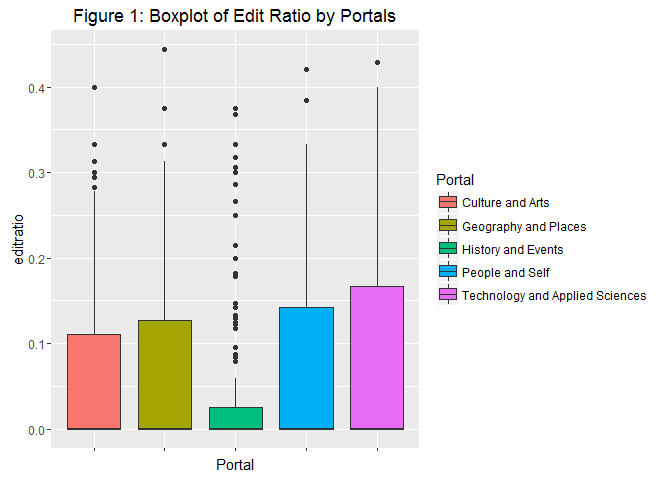

##### Codes for Analysis

This following codes consist all the codes we used for the analysis of vandalism on the Wikipedia data.

##### Reading data

``` r
wiki <- read.csv("Wiki_final2.csv",header = TRUE,stringsAsFactors = FALSE) 
wiki$editratio=wiki$Number.of.reverted.edits/wiki$Number.of.edits
wiki$Page.View=as.integer(as.factor(wiki$Page.View))
wiki$Portal[wiki$Portal=="REligion and Belief Systems"]="Religion and Belief Systems"
wiki$Portal[wiki$Portal=="CUlture and Arts"]="Culture and Arts"

wiki=wiki[!wiki$Portal=="",]
```

``` r
freqcount=data.frame(table(wiki$Portal))

names(freqcount)=c("Category","Frequency")
freqcount=arrange(freqcount,desc(Frequency))
kable(freqcount,caption="Table 1: Frequency Count")
```

| Category                        |  Frequency|
|:--------------------------------|----------:|
| People and Self                 |       1554|
| Culture and Arts                |       1042|
| Geography and Places            |        296|
| History and Events              |        158|
| Technology and Applied Sciences |        143|
| Health and Fitness              |        140|
| Society and Social Sciences     |        131|
| Natural and Physical Sciences   |        121|
| Religion and Belief Systems     |         96|
| General Reference               |         53|
| Philosophy and Thinking         |         22|
| Mathematic and Logics           |         20|

``` r
# Select the top five portals for further analysis
peopleself <- subset(wiki,Portal=="People and Self")
cultureart <- subset(wiki,Portal=="Culture and Arts")
techapplied <- subset(wiki,Portal=="Technology and Applied Sciences")
geography <- subset(wiki,Portal=="Geography and Places")
history <- subset(wiki,Portal=="History and Events")
```

What can be seen in the table is that the number of observations between portals are vastly different. People and Self has the most observations (1554) while Culture and Arts have the second most observations (1042). The portal category which has the third highest observations is Geography and Places (296), followed by History and Events (158) and Technology and Applied Science (143).

Because of the unbalance nature of the data between portal, a reasonable way is to draw a sample amount of samples from the top five portals. We used the following way to calculate the reasonable sample size in order to compare the difference between the top five portal groups with 80% of power.

The sample size is calculated by using power of 80% and delta of 0.3 which is recommeneded by most literatures.

``` r
power.anova.test(power=0.8,between.var=0.0001981278,within.var=0.0092,group=5)
```


         Balanced one-way analysis of variance power calculation 

             groups = 5
                  n = 139.5048
        between.var = 0.0001981278
         within.var = 0.0092
          sig.level = 0.05
              power = 0.8

    NOTE: n is number in each group

Since Technology and Applied Science- the fifth largest groups have 143 samples in total, it is reasonable to draw 140 samples from each portal randomly without replacement.

``` r
set.seed(1000)
ps <- peopleself[sample(1:nrow(peopleself),140,replace=FALSE),]
set.seed(1000)
ca <- cultureart[sample(1:nrow(cultureart),140,replace=FALSE),]
set.seed(1000)
ta <- techapplied[sample(1:nrow(techapplied),140,replace=FALSE),]
set.seed(1000)
gp <- geography[sample(1:nrow(geography),140,replace=FALSE),]
set.seed(1000)
hp <- history[sample(1:nrow(history),140,replace=FALSE),]

wikifinal <- rbind(ps,ca,ta,gp,hp)
wikifinal$Status=as.factor(wikifinal$Status)
wikifinal$Portal=as.factor(wikifinal$Portal)
```

### Question 1: Are the population edit ratios among the top five portals equal?

Because articles in certain areas are more viewed than others, determining whether those articles are more prone to vandalism is crucial. We wish to determine whether the edit ratio is the same across all of the portals. For each of the top five portals, a random sample of 140 pages was taken. Only the five most popular portals (that is, those mentioned in the Data Collection section) were considered, as the number of articles in the others as less than the minimum of 140 required for an effect size of 0.30, and a desired test power of 0.80. Table 2 provides the means and standard deviations of the edit ratios (Rat) and number of reverted edits (Rev) for those portals (n = 140 for all portals).

| Portal                          | variable                 |        mean|  median|  standard\_deviation|
|:--------------------------------|:-------------------------|-----------:|-------:|--------------------:|
| People and Self                 | Number.of.reverted.edits |   0.7928571|       0|             1.446884|
| People and Self                 | Number.of.edits          |   7.5714286|       4|             1.446884|
| People and Self                 | editratio                |   0.0703668|       0|             1.446884|
| Culture and Arts                | Number.of.reverted.edits |   1.2000000|       0|             2.533800|
| Culture and Arts                | Number.of.edits          |  15.3785714|       7|             2.533800|
| Culture and Arts                | editratio                |   0.0662890|       0|             2.533800|
| Technology and Applied Sciences | Number.of.reverted.edits |   0.7714286|       0|             1.310406|
| Technology and Applied Sciences | Number.of.edits          |   7.5214286|       4|             1.310406|
| Technology and Applied Sciences | editratio                |   0.0859712|       0|             1.310406|
| Geography and Places            | Number.of.reverted.edits |   0.8428571|       0|             1.751757|
| Geography and Places            | Number.of.edits          |   9.9071429|       5|             1.751757|
| Geography and Places            | editratio                |   0.0704105|       0|             1.751757|
| History and Events              | Number.of.reverted.edits |   1.0571429|       0|             2.843069|
| History and Events              | Number.of.edits          |  34.2071429|       6|             2.843069|
| History and Events              | editratio                |   0.0462824|       0|             2.843069|

##### Exploratory Data Analysis

``` r
# Boxplot of edit ratio for each portal #
ggplot(wikifinal,aes(x=Portal,y=editratio,fill = Portal))+geom_boxplot()+ggtitle("Figure 1: Boxplot of Edit Ratio by Portals")
```



As shown in Figure 1, the data for all five portals are right-skewed, suggesting that the median edit ratio is a better measure of central tendency than the mean edit ratio. While exploratory data analysis reveals that the distribution of the data for all of the portals were clearly non-normal, a pairwise Kolmogorov{Smirnov test testing each sample against the others indicated that the distributions were similarly skewed (the smallest p-value for these tests was 0.06). While ANOVA might be justifiable in such a situation, the non-parametric Kruskal{Wallis test is presumed more robust as it does not depend on the presumption of Knowing that the normality assumption for ANOVA is violated, Kruskal-Wallis Test- a non-parametric test is used in placed of ANOVA. There are several assumptions that Kruskal-Wallis Test requires. First, the dependent variable (eg.edit ratio) is ordinal. Second, the independent variable (eg. portal) is categorical. Since both assumption is fulfilled, we can proceed with Kruskal-Wallis Test to determine if the median of edit ratio is the same across the portals.

##### Kruskal-Wallis rank sum test- One-Way-ANOVA for edit ratios

``` r
kruskal.test(wikifinal$editratio ~ wikifinal$Portal)
```


        Kruskal-Wallis rank sum test

    data:  wikifinal$editratio by wikifinal$Portal
    Kruskal-Wallis chi-squared = 5.9102, df = 4, p-value = 0.206

``` r
pvalue=kruskal.test(wikifinal$editratio ~ wikifinal$Portal)[3]$p.value
```

Since the p-value is 0.2059528 which is greater than 0.05. We fail to reject the null hypothesis at 5 % of significant level and conclude that the population median are equal.

#### Question 2: Is there any relationship between the number of page views and the number of reverted edits?

``` r
## Question 2 ##

top5=wiki[wiki$Portal %in% portal,] #Subset the top five portals
ggplot(top5,aes(y=Number.of.reverted.edits,x=Page.View,color=Portal))+geom_point()+geom_smooth(method="lm",color="black",se=FALSE)+facet_grid(. ~ Portal)+ theme(legend.position="none")+ggtitle("Figure 2: Number of Reverted Edits versus Page View per Portals")
```


``` r
regressionresult=data.frame()

for (i in 1:5){
 data=top5[top5$Portal==portal[i],]
 lm=lm(data$Number.of.reverted.edits ~ data$Page.View)
 pvalue_beta0=summary(lm)[4]$coefficients[4]
 pvalue_beta1=summary(lm)[4]$coefficients[8]
 rsq=summary(lm)[8]$r.squared
 row=data.frame(Portal=portal[i],n=dim(data)[1],rsquared=rsq,pvalue=pvalue_beta1)
 regressionresult=rbind(regressionresult,row)
}

kable(regressionresult,caption=" Table 3: Regression Result")
```

| Portal                          |     n|   rsquared|     pvalue|
|:--------------------------------|-----:|----------:|----------:|
| People and Self                 |  1554|  0.0022503|  0.0615471|
| Culture and Arts                |  1042|  0.0001690|  0.6751485|
| Technology and Applied Sciences |   143|  0.0071325|  0.3159312|
| Geography and Places            |   296|  0.0034455|  0.3141876|
| History and Events              |   158|  0.0178035|  0.0946525|

As you can easily see in the scatterplot, there is no relationship between Page views and the number of reverted edits for each portal.P-values of each test is greater than 0.05, suggesting that we can conclude that the slope is zero for all five portals at a signficant level of 0.05, which means that it is not true that a page which is more viewed has more reverted edits or vice versa.

#### Question 3 Is there any difference in the response time (i.e., the time it takes to revert an "unconstructive" edit) among the different portals?

``` r
wikitime=read.csv("Wiki_timedata1.csv",header=TRUE)
finaltime=merge(wiki,wikitime,by="Page.Title")
mt=mean(finaltime$Average.response.time.seconds.)/60
mdt=median(finaltime$Average.response.time.seconds.)/60
sdt=sd(finaltime$Aver1age.response.time.seconds./60)
finaltime=finaltime[,c(1,3:9,11:dim(finaltime)[2])]
finaltime$Average.response.time=finaltime$Average.response.time.seconds./60/60
finaltime$Mobile..=gsub("%","",finaltime$Mobile..)
finaltime$Mobile..=as.numeric(finaltime$Mobile..)/100 #Convert Mobile Percentage to numeric

finaltime$Status=as.factor(finaltime$Status) #convert status to factor
finaltime$Number.of.reverted.edits=as.numeric(finaltime$Number.of.reverted.edits)#convert to numeric
finaltime$Number.of.edits=as.numeric(finaltime$Number.of.edits) #convert to numeric
finaltime$Page.View =as.numeric(finaltime$Page.View) #convert to numeric
```

As indicated in the Data Collection section, certain categories of articles are more viewed than others, and the two portals whose articles accounted for a majority of the page views in the one-week period were Culture and the Arts and People and Self. We wish to determine whether the response time (by either a human or a bot) differs, in general, for articles belong to those two portals.

The average response time is 94.6822577 minutes and the median is 10.7833333 minutes while the standard deviation of the response time is NA.

###### Exploring the response time

``` r
#ggpairs(~finaltime[,c(Average.response.time.seconds.,Mobile..,Number.of.edits,Number.of.reverted.edits,Page.View)], data=finaltime)

scatterplotMatrix(~Average.response.time.seconds.+Mobile..+Number.of.edits+Number.of.reverted.edits +Page.View|Status, data=finaltime,main="Figure 3: Scatter Plot Matrix")
```


``` r
a=finaltime$Average.response.time.seconds.
b=a[a<150000] # Remove extreme outliers
qplot(x=b,geom="histogram",xlab="Response Time (Minutes)",main="Figure 4: Histogram")
```

    ## `stat_bin()` using `bins = 30`. Pick better value with `binwidth`.


``` r
#Determining the shape and scale paramters for Weibull distribution
lx <- log(b)
m <- mean(lx)
v <- var(lx)
shape <- 1.2/sqrt(v)
scale <- exp(m + 0.572/shape)
#shape=parameters$estimate[[1]]
#scale=parameters$estimate[[2]]
qqPlot(b/60,distribution = "weibull",shape=shape,scale=scale,ylab="Response Time (minutes)",main="Figure 5: QQplot of response time versus Weibull Quantile")
```

 Figure 3 shows the results of exploratory data analysis of response time versus number of page views, number of edits, number of reverted edits, and mobile percentage; there appears to be no correlation. The right-skewness seen in Figure 4 suggests that mean is not an appropriate measure of central tendency for the response time; instead, the median is considered. (To wit, the data appear to be a Weibull distribution, per Figure 5; a rigorous goodness-of-fit could plausibly be run, but is unnecessary for the purposes of this question.)

``` r
peopleself <- subset(finaltime,Portal=="People and Self")
cultureart <- subset(finaltime,Portal=="Culture and Arts")
set.seed(57)
ps <- peopleself[sample(1:nrow(peopleself),140,replace=FALSE),]
set.seed(57)
ca <- cultureart[sample(1:nrow(cultureart),140,replace=FALSE),]
1/(mean(finaltime$Page.View)/7/24/3600)
```

    [1] 239.0552

``` r
wilcox.test(ps$Average.response.time.seconds.,ca$Average.response.time.seconds.,paired=TRUE)
```


        Wilcoxon signed rank test with continuity correction

    data:  ps$Average.response.time.seconds. and ca$Average.response.time.seconds.
    V = 4392.5, p-value = 0.2596
    alternative hypothesis: true location shift is not equal to 0

When comparing between the top two portals, we found that wilcoxon test fails to reject the null hypothesis of equality. Therefore, we cannot conclude that the median response time between the top two portals are the same.

#### Question 4 Is there a difference in the response time between pages that are semi-protected versus those that are unprotected?

``` r
#spliting the data between semi-protected and non-protected
npt=finaltime[finaltime$Status==0,]
pt=finaltime[finaltime$Status==1,]

#Determining the sample size
power.t.test(delta=0.3,sig.level = 0.05,power=0.8,type="t")
```


         Two-sample t test power calculation 

                  n = 175.3851
              delta = 0.3
                 sd = 1
          sig.level = 0.05
              power = 0.8
        alternative = two.sided

    NOTE: n is number in *each* group

``` r
#Taking 176 samples for both protection status
set.seed(88888)
npt <- npt[sample(1:nrow(npt),176,replace=FALSE),]
set.seed(88888)
pt <- pt[sample(1:nrow(pt),176,replace=FALSE),]
wikifinal3=rbind(npt,pt)
```

``` r
#boxplot with sample data
finaltime$Status=ifelse(finaltime$Status==0,"Unprotected","Protected")
qplot(data=finaltime,x=Status,y=Average.response.time,geom="boxplot",main="Boxplot of Average Response Time per Status",ylab="Figure 6: Average Response Time (Minutes)")
```


``` r
md0=median(finaltime$Average.response.time.seconds.[finaltime$Status==0])/60/60
m0=mean(finaltime$Average.response.time.seconds.[finaltime$Status==0])/60/60
sd0=sd(finaltime$Average.response.time.seconds.[finaltime$Status==0]/60/60)
md1=median(finaltime$Average.response.time.seconds.[finaltime$Status==1])/60/60
m1=mean(finaltime$Average.response.time.seconds.[finaltime$Status==1])/60/60
sd1=sd(finaltime$Average.response.time.seconds.[finaltime$Status==1]/60/60)
```

For unprotected pages, the median response time is NA, the mean response time is NaN and its standard deviation is NA.

For semi-protected pages, the median response time is NA, the mean response time is NaN and its standard deviation is NA.

``` r
#wilcox-test for response time versus status p value > 0.05
wilcox.test(x= npt$Average.response.time.seconds., y=pt$Average.response.time.seconds.,alternative="t",var.equal=TRUE)
```


        Wilcoxon rank sum test with continuity correction

    data:  npt$Average.response.time.seconds. and pt$Average.response.time.seconds.
    W = 15468, p-value = 0.9837
    alternative hypothesis: true location shift is not equal to 0

Thus, we are once again testing H0 : MX =???? MY = 0 vs. H1 :The opposite, where X and Y are random variables denoting the response times of semi-protected articles and unprotected articles, respectively, and the symbol M refers to median. Restated, these hypotheses are equivalent to H0 : P(X &gt; Y ) = P(Y &gt; X) vs. H1 : P(X &gt; Y ) 6= P(Y &gt; X); by this restatement and because our responses are independent and ordinal, the Wilcoxon rank-sum test may be used. For this test, the reported p-value was 0.9837. As a result, we fail to reject the null hypothesis at 5% significance level and conclude that the amount of time required to revert an edit is consistent for the semi-protected and unprotected levels.

Discussion
==========

While this investigation does provide information about popular articles, the limitation of our data mining approach | that is, considering only the 5,000 most-popular articles as our population | does not allow us to necessarily extend the results to the entire population of Wikipedia articles. Altering the sampling algorithm to use an interval longer than one week might yield results that are more accurate in the long-run, and the population to be considered (i.e., all Wikipedia articles) might be better sampled by interacting with the MediaWiki API to use Wikipedia's random article function, might aord the ability to conduct this analysis on otherwise unpopular articles. In doing so, portals that have fewer highly popular articles would be better represented; for example, while the Philosophy and Thinking portal has very few articles in the top 5,000 list, it contains a large number of unprotected articles that might on aggregate be more prone to vandalism than the highly- monitored People and Self portal. Likewise, in our study, we assumed that all edit summaries containing "revert" were done to revert unconstructive edits and that only the word " was an indicator for an unconstructive edit being reverted, for simplicity. However, sometimes vandalism is disguisedwith the edit summary ", and thus that keyword by itself is not the best indicator of vandalism being reverted. Similarly, additional conditions, such as more granularity or additional keywords, could be included in the algorithm to determine if a revert is based on something unconstructive. This, of course, involves heuristics of the sort that are part of Wikipedia's anti-vandalism bots, and are beyond the scope of this investigation. \#Conclusion The median edit ratios for the top five portals are the same, indicating that the popularity of the articles in any one of those portals does not make that portal more prone to vandalism. There is no linear relationship between the number of page views and the number of reverted edits, and therefore we dismiss intuition and conclude that the popularity of an article is not a good predictor of the number of edits that are considered unconstructive. The median response times for the two most popular portals are equal, and we conclude that those articles are equally monitored. The semi-protection status of an article has no effect on response time, and we conclude that both semi-protected and unprotected articles are equally monitored.

Although one's opinion will certainly shape whether to consider Wikipedia to be a reliable encyclopedia, the analysis shows that the site can be a reasonably well-monitored source of information about popular topics, but acknowledge that users of this site (and of any medium, for that matter) should remain critical consumers of information.

Acknowledgement
===============

We thank the members of Wikipedia community for proving the inspiration for this analysis. We also thank Dr. Keying Ye for providing feedback and support in the design and execution of this analysis. This report was done as a team effort. Our team members include: Kinu Panda, Chris Roberts, Tinghe Zhang and myself.
